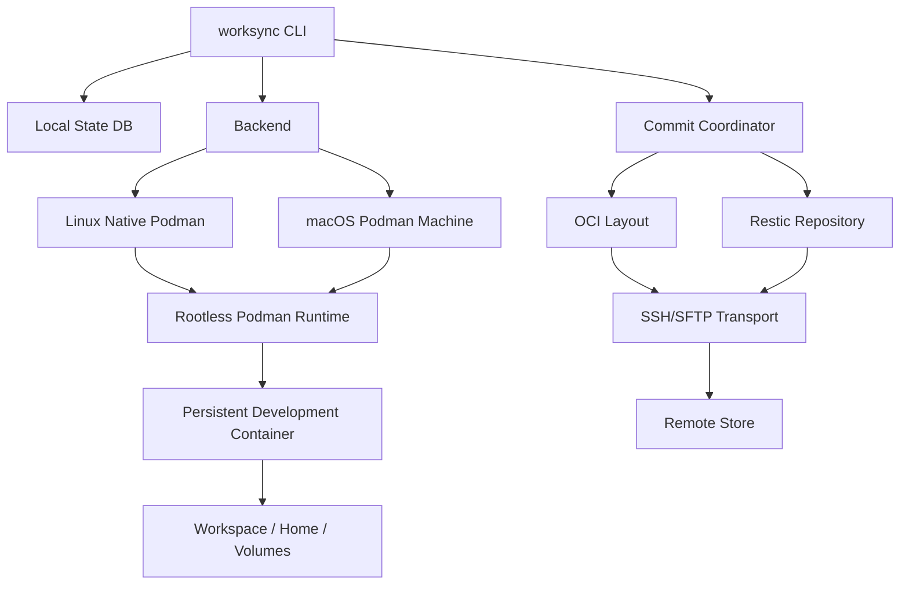
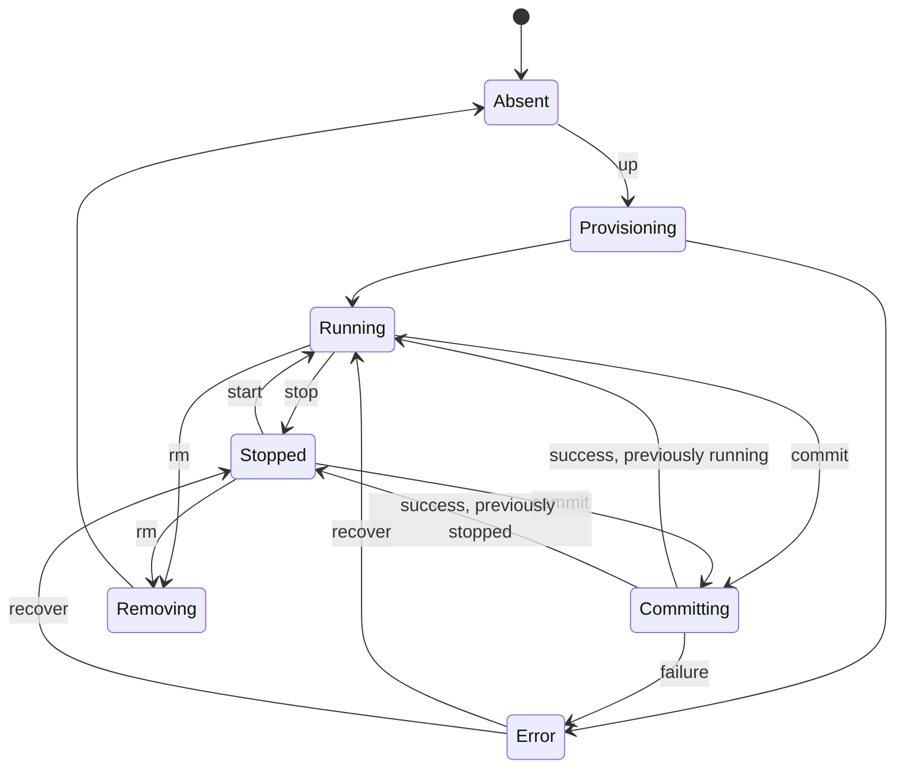

# Worksync v0 正式设计文档

- 状态：Draft for implementation
- 版本：0.1
- 日期：2026-08-17
- 目标读者：Worksync 开发者、评审者和早期使用者

## 1. 摘要

Worksync 是一个面向本地与远端开发场景的可迁移工作环境管理工具。它使用 OCI/Docker 镜像定义开发容器，以 rootless Podman 运行长期存在的开发环境，并把容器环境、工作区和选定数据卷组合成显式版本。

Worksync 不进行后台实时文件同步。用户在需要迁移时显式执行：

```text
up -> 修改 -> commit -> push -> 另一台机器 pull -> up
```

v0 使用 SSH/SFTP 作为唯一远端传输协议。SSH 只承载提交数据的 push/pull，不参与本地开发服务的端口访问。容器端口通过 Podman 和 backend 的原生网络能力直接暴露到宿主机。

v0 优先复用现有组件：

- rootless Podman：OCI 镜像和开发容器生命周期。
- Podman Machine：macOS 上的 Linux VM 和容器运行环境。
- Restic：工作区与数据卷的本地快照、去重、加密和 SFTP 传输。
- OpenSSH/SFTP：远端认证与传输。

v0 不自行实现 QEMU 生命周期、文件分块算法、容器运行时或实时同步协议。

## 2. 背景与问题

开发者经常在多台机器之间切换：

- macOS 笔记本。
- Linux 工作站。
- 物理或虚拟化的 KVM Linux 服务器。
- 不同 CPU 架构的 amd64/arm64 机器。

仅同步项目源码不能覆盖下列状态：

- 容器中临时安装的系统包和工具。
- 用户 HOME 中的开发配置。
- 尚未提交到 Git 的工作区内容。
- 本地数据库和其他命名卷。
- 端口、环境变量、启动命令等运行配置。

直接同步 VM 磁盘或活动 qcow2 overlay 存在以下问题：

- 活跃块设备无法安全双向合并。
- 文件级冲突不可解释。
- CPU 架构和虚拟硬件状态不兼容。
- 文件很大，少量修改也可能触发大量传输。
- 运行中的磁盘状态可能不一致。

Worksync 因此选择“容器环境版本 + 文件级快照 + 显式 push/pull”，而不是同步活动虚拟磁盘。

## 3. 目标

### 3.1 v0 必须实现

1. 在 Linux 上使用 native rootless Podman 创建长期开发容器。
2. 在 macOS 上通过 Podman Machine 使用相同的 Worksync manifest。
3. 支持任意当前平台可运行的 OCI/Docker 镜像作为开发环境基础。
4. 支持把宿主机目录挂载为 workspace，也支持由 backend 管理 workspace。
5. 容器 stop/start 后保留 RootFS、workspace、home 和命名卷。
6. 直接向宿主机发布 TCP 端口，默认只监听 `127.0.0.1`。
7. 显式提交容器 RootFS、workspace 和选定数据卷。
8. 通过 SSH/SFTP push/pull 已提交版本。
9. 只上传远端缺失的 OCI blob；工作区使用 Restic 去重。
10. 支持本地版本、命名 tag、回滚和远端冲突拒绝。
11. 操作失败时保留上一个可用版本，并能够恢复到稳定状态。

### 3.2 设计目标

- 默认无 root daemon。
- 后端差异对用户透明。
- Manifest 是期望状态的来源，容器是可重建的执行实例。
- 数据和运行时元数据分离。
- 提交对象不可变，以内容摘要标识。
- 本地开发不依赖远端在线。
- 默认不暴露服务到局域网。
- 保留未来自定义 QEMU backend、Windows backend 和 OCI Registry transport 的扩展点。

## 4. 非目标

v0 明确不实现：

- 后台实时文件同步。
- 活动 qcow2/VM 根盘同步。
- 自定义 QEMU VM 管理器。
- Windows backend。
- Docker Compose 和任意多容器编排。
- Kubernetes backend。
- JuiceFS workspace driver。
- 百度网盘 transport。
- 自动三方文件合并。
- UDP、SCTP 自动端口发布。
- GPU、USB、PCI 设备透传。
- 完整 Dev Container Specification。
- 对恶意镜像提供强安全隔离。
- 跨 CPU 架构迁移容器 RootFS writable layer。

## 5. 术语

| 术语 | 定义 |
|---|---|
| Project Spec | 用户维护的 `worksync.yaml`，描述期望开发环境。 |
| Workspace | 开发项目文件，挂载到容器的 `/workspace` 或自定义路径。 |
| Environment | 基础 OCI 镜像加容器 RootFS writable layer。 |
| Volume | workspace 以外的持久化目录。 |
| Backend | 提供 Podman 执行环境和端口暴露能力的平台适配器。 |
| Runtime | 对 Podman pull/create/start/stop/exec/commit 的封装。 |
| Commit | Environment 和选定文件卷的一次不可变版本。 |
| Ref | 指向 commit digest 的可变名称，例如 `latest` 或 `server-ready`。 |
| Local Store | 当前机器上的镜像、快照、commit 和状态存储。 |
| Remote Store | 通过 SSH/SFTP 访问的远端内容存储。 |

## 6. 总体架构



### 6.1 控制面

控制面由 `worksync` CLI 负责：

- 解析 `worksync.yaml`。
- 选择 backend。
- 对当前项目加锁。
- 调用 Podman runtime。
- 协调 commit、push、pull 和 rollback。
- 维护本地状态数据库和 refs。

v0 不要求常驻 host daemon。macOS backend 可以通过 Podman remote connection 或 Podman Machine 提供的命令接口执行操作。

### 6.2 数据面

数据面包括：

- Podman OCI image store。
- 容器 writable layer。
- workspace/home/volume 目录。
- Restic repository。
- OCI layout blobs。
- SSH/SFTP remote store。

开发服务的网络流量不经过 SSH transport。

Workspace 可以来自宿主机 bind mount，也可以位于 backend 管理的持久目录。两者进入容器后使用相同的 commit/snapshot 语义。

## 7. Backend 选择

### 7.1 自动选择规则

```text
Linux  -> native-podman
macOS  -> podman-machine
其他   -> unsupported in v0
```

用户可以显式覆盖：

```bash
worksync up --backend native-podman
worksync up --backend podman-machine
```

### 7.2 Linux native backend

前置条件：

- Linux kernel 支持 user namespace。
- 安装 Podman。
- 用户存在 `/etc/subuid` 和 `/etc/subgid` 映射。
- 推荐 cgroups v2。
- 推荐 native rootless OverlayFS；必要时使用 fuse-overlayfs。

Linux backend 不创建额外 VM，因此在本身不支持 nested KVM 的云主机中也能运行。

### 7.3 macOS Podman Machine backend

职责：

- 检测 Podman Machine 是否存在。
- 在用户授权的情况下创建或启动 machine。
- 建立 Podman remote connection。
- 在 machine 内执行 snapshot helper。
- 将发布端口暴露到 macOS localhost。

Worksync 不把 Podman Machine 的 SSH 登录作为用户工作流。内部实现可以使用 Podman 提供的 machine/remote 接口。

### 7.4 未来 QEMU backend

未来可增加 `qemu` backend：

- Linux 使用 KVM。
- macOS 使用 HVF。
- Windows 使用 WHPX。
- 无硬件加速时显式允许 TCG。

该 backend 必须复用本文定义的 Runtime、PortPublisher 和 Store 接口，不改变 Project Spec 和 Commit Descriptor。

## 8. Rootless Podman 运行时

### 8.1 选择原因

v0 选择 Podman，而不是直接集成 containerd：

- daemonless，适合单用户开发环境。
- rootless 模式成熟。
- 提供 pull/create/start/stop/exec/diff/commit/save。
- 支持 Docker/OCI 镜像和 OCI 输出。
- 提供 Docker-compatible API，可为未来 Dev Container 支持复用。

未来如果需要直接控制 snapshotter 和 CAS，可增加 containerd runtime，不改变上层接口。

### 8.2 容器是长期开发环境

默认情况下：

- `worksync stop` 只停止容器，不删除容器或 volume。
- `worksync start` 恢复原容器和 RootFS writable layer。
- `worksync up` 在容器不存在时创建，在配置漂移时重建。
- `worksync rm` 才删除容器；删除 volume 必须单独确认。

`persistentRoot: true` 表示容器 RootFS writable layer 在本机长期保留。它只有在执行 environment commit 后才成为可迁移对象。

### 8.3 任意镜像兼容边界

Worksync 不能假设镜像包含：

- `bash`。
- `sleep`。
- SSH server。
- systemd。
- 普通用户。

v0 通过 bind mount 注入静态 `worksync-agent`，并由 Worksync 覆盖或包装容器启动命令。对于没有可执行 shell 的 distroless 镜像：

- 允许作为服务镜像运行。
- `worksync shell` 返回明确的不支持错误。
- 未来可以增加 debug sidecar。

### 8.4 用户和权限

默认开发用户在 backend Linux 环境中使用固定 UID/GID 1000。容器优先使用：

1. Project Spec 指定的 `user`。
2. 镜像配置中的非 root 用户。
3. rootless user namespace 内的容器 root。

Worksync 必须保证 workspace 对实际容器用户可写。v0 可以通过 `--userns=keep-id`、预创建目录和受控 chown 实现，但不得递归修改用户未授权的宿主目录所有权。

## 9. 本地数据布局

### 9.1 Host 元数据

```text
~/.config/worksync/
└── config.yaml

~/.local/share/worksync/
├── state.db
├── locks/
├── projects/
├── commits/
├── refs/
├── oci/
└── restic/
```

在 macOS 上遵循等价的用户应用数据目录，但 CLI 输出应显示实际路径。

### 9.2 Backend 数据根目录

```text
<backend-data-root>/
├── workspaces/<project-id>/
├── homes/<project-id>/
├── volumes/<project-id>/<volume-name>/
├── caches/<project-id>/<cache-name>/
├── secrets/<project-id>/
└── staging/
```

Linux native backend 可以直接位于 host 数据目录。Podman Machine backend 的数据根位于 guest 的持久磁盘中。

### 9.3 Workspace Source

Workspace 支持两种来源：

| Source | 物理位置 | 适用场景 |
|---|---|---|
| `host` | 宿主机目录，通过 backend 挂载进容器环境 | 使用宿主 IDE 编辑、已有本地仓库。 |
| `managed` | backend 的 `workspaces/<project-id>` | 完全在开发环境内工作、从远端 commit 恢复。 |

`source: host` 时：

- Linux native 直接使用 bind mount。
- macOS 通过 Podman Machine 的 host volume sharing 暴露目录。
- Worksync 必须在创建容器前检查路径是否对 machine 可见。
- Snapshot helper 从 backend 中可见的挂载点读取文件，但不得修改宿主目录所有权。
- APFS 与 Linux 文件权限、大小写和 symlink 语义差异必须在 `doctor` 中提示。

`source: managed` 时，workspace 位于 backend 持久目录；宿主编辑器需要通过容器/远端开发能力访问。Pull 默认恢复为 managed workspace，除非用户显式指定一个空的 host 目录作为目标。

### 9.4 状态数据库

`state.db` 使用 SQLite WAL 模式，并通过纯 Go driver 避免 CGO 依赖。它存储派生状态，不代替用户的 `worksync.yaml`。

最少表：

- `projects`
- `containers`
- `volumes`
- `ports`
- `commits`
- `refs`
- `operations`

每个修改操作写入 `operations`，用于崩溃后判断是否需要清理 staging 或恢复容器状态。

## 10. Volume 策略

| Policy | 本地重启保留 | 默认 commit | 默认 push | 用途 |
|---|---:|---:|---:|---|
| `tracked` | 是 | 是 | 是 | workspace、重要配置。 |
| `persistent` | 是 | 否 | 否 | 数据库、可选持久数据。 |
| `cache` | 是 | 否 | 否 | node_modules、包缓存、编译缓存。 |
| `secret` | 运行时 | 否 | 否 | token、密钥、凭据。 |
| `ephemeral` | 否 | 否 | 否 | 临时输出和 scratch。 |

Project Spec 可以通过 `commit.volumes` 显式覆盖默认选择。

### 10.1 数据库一致性

对运行中的数据库目录执行文件级 snapshot 只能得到 crash-consistent 状态。v0 支持两类 snapshot hook：

```yaml
snapshot:
  mode: stop
  services: [db]
```

或：

```yaml
snapshot:
  mode: command
  pre: ["pg_dump", "..."]
  post: ["..."]
```

未配置 hook 的 persistent volume 不默认进入 commit。

## 11. 端口与网络

### 11.1 用户语义

用户声明容器端口和最终宿主监听地址：

```yaml
ports:
  - name: web
    target: 3000
    published: 3000
    listen: 127.0.0.1
    protocol: tcp

  - name: debug
    target: 9229
    published: auto
    listen: 127.0.0.1
    protocol: tcp
```

- `target`：容器端口。
- `published`：宿主端口或 `auto`。
- `listen`：宿主监听地址，默认 `127.0.0.1`。
- `protocol`：v0 仅支持 `tcp`。

应用必须在容器内监听 `0.0.0.0:<target>` 或容器网络接口，不能只监听容器内 `127.0.0.1`。

### 11.2 Linux native

Podman 直接发布：

```text
Host localhost:3000 -> Container:3000
```

### 11.3 Podman Machine

内部可能存在两级转发：

```text
macOS localhost:3000 -> Machine:3000 -> Container:3000
```

这属于 backend 实现细节。用户始终访问 `listen:published`，不需要 SSH tunnel。

### 11.4 PortPublisher 接口

```go
type PortPublisher interface {
    Publish(ctx context.Context, projectID string, spec PortSpec) (Endpoint, error)
    Unpublish(ctx context.Context, projectID string, name string) error
    List(ctx context.Context, projectID string) ([]Endpoint, error)
}
```

`published: auto` 必须记录实际端口，并在容器 stop/start 后尽量复用。发生冲突时分配新端口并清晰输出变化。

### 11.5 暴露范围

- 默认 `127.0.0.1`。
- `0.0.0.0` 或局域网地址必须显式配置。
- Worksync 不自动修改远端服务器防火墙或云安全组。
- rootless 模式不保证能够绑定 `<1024` 端口；v0 遇到该配置时给出错误和高位端口建议。

## 12. Project Spec

### 12.1 示例

```yaml
schemaVersion: 1
name: dsh-dev

runtime:
  engine: podman
  backend: auto
  rootless: true

container:
  image: node:24
  persistentRoot: true
  workdir: /workspace
  user: dev
  command: ["/opt/worksync/bin/worksync-agent", "idle"]
  environment:
    NODE_ENV: development

ports:
  - name: web
    target: 3000
    published: 3000
    listen: 127.0.0.1
    protocol: tcp

volumes:
  workspace:
    source:
      type: host
      path: ./
    target: /workspace
    policy: tracked

  home:
    target: /home/dev
    policy: persistent

  npm-cache:
    target: /home/dev/.npm
    policy: cache

  dsh-config:
    target: /home/dev/.dsh
    policy: tracked

commit:
  environment: true
  volumes:
    - workspace
    - dsh-config

remote:
  default: origin
  remotes:
    origin:
      url: ssh://user@example.com/~/worksync-store
```

### 12.2 解析规则

- 未知字段默认报错，避免拼写错误被静默忽略。
- 相对路径以 `worksync.yaml` 所在目录为基准。
- Volume 未声明 `source` 时由 backend 管理；声明 `source.type: host` 时必须提供 `path`。
- 环境变量展开必须显式使用 `${VAR}`。
- Secret 不允许直接写入普通 environment 字段；应引用 secret provider 或本地文件。
- Image tag 在创建时解析为 digest，并把 digest 记录到本地状态。

## 13. 生命周期状态机



### 13.1 幂等要求

- 重复 `up` 不创建重复容器或 volume。
- 重复 `stop`、`start` 返回成功并说明当前状态。
- `pull` 已存在的 commit 不重复下载内容。
- `push` 已存在的 blob 不重复上传。
- 崩溃恢复不更新 ref 到不完整 commit。

## 14. Commit 模型

### 14.1 Commit 组成

一次 Worksync commit 包含：

1. Environment OCI image descriptor。
2. Workspace Restic snapshot ID。
3. 被选 volume 的 Restic snapshot ID。
4. 运行配置摘要。
5. 父 commit digest。
6. 平台信息。

Commit Descriptor 使用 canonical JSON 序列化并计算 SHA-256：

```json
{
  "schemaVersion": 1,
  "project": "dsh-dev",
  "platform": {
    "os": "linux",
    "architecture": "arm64"
  },
  "environment": {
    "base": "docker.io/library/node@sha256:...",
    "image": "sha256:..."
  },
  "snapshots": {
    "workspace": "restic:...",
    "dsh-config": "restic:..."
  },
  "configDigest": "sha256:...",
  "parent": "sha256:...",
  "message": "configured dsh",
  "createdAt": "2026-08-17T00:00:00Z"
}
```

### 14.2 Commit 流程

1. 获取 project 独占锁。
2. 验证当前状态为 Running 或 Stopped。
3. 写入 `operations`，状态设为 Committing。
4. 执行所有 pre-commit hook。
5. 如果容器正在运行，暂停容器并执行文件系统 flush。
6. 当 `commit.environment=true` 时执行 Podman commit，且不包含 mounted volumes。
7. 将 environment 输出为 OCI layout，校验所有 blob digest。
8. 对选定 tracked/persistent volume 创建 Restic snapshot。
9. 写入 Commit Descriptor staging 文件。
10. 校验 commit 所有依赖均已存在。
11. 原子移动 descriptor 到 commits 目录。
12. 最后原子更新本地 ref。
13. 恢复容器并执行 post-commit hook。
14. 将 operation 标记为成功。

### 14.3 失败规则

- 在 ref 更新前失败：删除或保留可回收 staging，不改变当前版本。
- 容器暂停后失败：必须在 defer/finally 路径恢复容器。
- post-commit hook 失败：commit 保留，但不自动 push；状态标记为需要关注。
- 环境 commit 成功但 volume snapshot 失败：不产生 Worksync commit。

### 14.4 RootFS 与 Volume 边界

Worksync 不使用 Podman `commit --include-volumes`。RootFS 和 volume 分开提交，以便：

- workspace 在不同架构之间恢复。
- cache volume 不被意外打包。
- 数据库 volume 使用独立一致性策略。
- Environment OCI layer 继续使用标准镜像去重。

## 15. Ref 与冲突

Ref 是一个小型 JSON 对象：

```json
{
  "commit": "sha256:...",
  "previous": "sha256:...",
  "updatedAt": "2026-08-17T00:00:00Z"
}
```

Push 使用 compare-and-swap 语义：

- 本地记录上次看到的远端 ref。
- push 前重新读取远端 ref。
- 如果远端已经从父 commit 前进，拒绝覆盖。
- 用户可以 pull、创建新 tag，或未来执行 merge。

v0 不提供 `--force` 覆盖共享 ref。删除或强制移动远端 ref 属于未来的管理命令。

## 16. SSH/SFTP Remote Store

### 16.1 目录结构

```text
<remote-root>/
├── version
├── oci/
│   └── blobs/sha256/
├── restic/
├── commits/sha256/
├── refs/<project>/
└── tmp/
```

Remote Store 不要求常驻 Worksync 服务，只要求：

- SSH 公钥认证。
- SFTP subsystem。
- 同一文件系统内 rename。
- 足够的磁盘空间。

### 16.2 SSH URL

```text
ssh://user@host/absolute/path
ssh://user@host/~/home-relative-path
ssh://user@host:2222/absolute/path
```

URL parser 必须区分绝对路径和用户 HOME 相对路径，不能依赖远端 shell 对 `~` 的隐式展开。

### 16.3 Push 流程

1. 验证 SSH host key。
2. 读取远端 store version。
3. 读取并校验目标 ref。
4. 枚举 environment OCI blobs。
5. 通过 SFTP stat 检查远端 blob 是否存在。
6. 仅上传缺失 blob 到 `tmp`，校验后 rename 到 digest 路径。
7. 使用 Restic copy 将本地 snapshot 复制到远端 SFTP repository。
8. 上传 Commit Descriptor。
9. 再次验证目标 ref 未变化。
10. 上传临时 ref，并原子 rename 为最终 ref。

### 16.4 Pull 流程

1. 读取远端 ref 和 Commit Descriptor。
2. 验证 descriptor digest。
3. 下载本地缺失的 OCI blobs。
4. 导入 environment image 到 Podman。
5. 将需要的 Restic snapshot 复制到本地 repository。
6. 恢复到新的 staging workspace/volume 目录。
7. 校验恢复结果。
8. 原子替换目标 workspace 或创建新 checkout。
9. 更新本地 ref。

### 16.5 断点续传

- OCI blob 上传使用 `.partial` 临时文件。
- 重试时根据大小和 digest 决定续传或重传。
- Restic 负责自己的 pack 和 repository 恢复。
- Commit Descriptor 和 ref 始终最后写入。

### 16.6 后续优化

大量 SFTP stat 会产生高延迟。未来可以增加可选 `worksync-receive` helper：

```text
ssh host worksync-receive check < manifest
```

一次返回缺失 blob，并允许流式上传 pack。v0 不依赖该 helper。

## 17. 跨平台与跨架构

### 17.1 Workspace

Workspace snapshot 默认标记为 platform-independent，但下列内容应配置为 cache 或忽略：

- `node_modules`
- Python virtualenv
- Rust `target`
- Go build cache
- 平台原生二进制

### 17.2 Environment

Environment commit 是平台相关对象：

```text
linux/amd64
linux/arm64
```

另一架构 pull 时：

- 如果 commit 仅包含 workspace，可基于相同 Project Spec 拉取本机架构基础镜像并恢复 workspace。
- 如果要求恢复 environment writable layer，则必须存在匹配架构版本。
- v0 不自动模拟另一 CPU 架构。

### 17.3 Config Digest

Commit 记录 Project Spec digest。Pull 后如果当前 spec 不同，Worksync 必须显示差异，并要求用户明确选择：

- 使用 commit 内配置。
- 使用本地配置重建。
- 创建新的项目实例。

## 18. CLI 设计

### 18.1 项目生命周期

```bash
worksync init
worksync up [--backend auto]
worksync status
worksync shell [-- command...]
worksync exec -- command...
worksync stop
worksync start
worksync rm
```

### 18.2 端口

```bash
worksync ports
worksync expose 3000
worksync expose 3000:8080
worksync unexpose 3000
```

`expose` 的默认监听地址是 `127.0.0.1`。

### 18.3 版本

```bash
worksync diff
worksync commit -m "configured dsh"
worksync log
worksync tag server-ready
worksync rollback <commit-or-tag>
```

### 18.4 远端

```bash
worksync remote add origin ssh://user@host/~/worksync-store
worksync push [origin] [tag]
worksync pull [origin] [tag]
worksync fetch [origin]
```

### 18.5 输出

- 人类输出默认简洁、包含下一步建议。
- 所有查询命令支持 `--json`。
- 错误包含稳定 error code，例如 `WB_PORT_IN_USE`。
- 进度输出不得泄露 secret、SSH private key 路径内容或环境变量值。

## 19. Go 模块结构

```text
cmd/worksync/
internal/
├── backend/
│   ├── backend.go
│   ├── native/
│   └── podmanmachine/
├── runtime/
│   └── podman/
├── manifest/
├── project/
├── workspace/
├── volume/
├── ports/
├── commit/
├── snapshot/
│   └── restic/
├── oci/
├── transport/
│   └── ssh/
├── store/
├── state/
├── lock/
└── cli/
```

核心原则：

- Podman 命令构造集中在 runtime package。
- SSH/SFTP 不直接操作业务对象，只实现 blob/ref transport。
- Commit coordinator 不依赖具体 backend 路径。
- Backend 返回能力集合，缺失能力在执行前失败。

## 20. 安全模型

### 20.1 默认保护

- rootless Podman。
- 端口默认监听 `127.0.0.1`。
- SSH host key 必须校验。
- 优先使用 ssh-agent，不保存 SSH 私钥或明文密码。
- Restic repository 必须加密。
- Secret volume 默认不 commit、不 push。
- Remote ref 更新使用原子 rename。

### 20.2 限制

- Worksync 不是针对恶意镜像的强隔离沙箱。
- 容器可以读取显式挂载的 workspace 和 volume。
- 如果用户把 secret 写入容器 RootFS，再执行 environment commit，secret 可能进入 OCI layer。
- 远端 OCI blobs 在 v0 默认按 OCI 原始格式存储，不保证内容加密。

Worksync 应在 environment commit 前检查常见 secret 文件名并给出警告，但不能承诺完整检测。

## 21. 并发和锁

- 同一 project 同时只允许一个修改操作。
- `status`、`log` 等只读操作可以并发。
- 全局 OCI blob 下载按 digest 去重。
- Push 同一 remote ref 时执行乐观并发检查。
- 不允许两个进程同时恢复到同一个 workspace 目录。

锁文件包含 PID、启动时间和 operation ID。发现疑似陈旧锁时，必须检查对应进程和 operation，不得仅凭超时直接删除。

## 22. 崩溃恢复

启动任何修改命令前执行 recovery scan：

1. 查找状态为 running 的未完成 operation。
2. 检查对应进程是否仍存在。
3. 恢复被暂停的容器。
4. 清理无引用的 staging 文件。
5. 保留已完成但未更新 ref 的不可变对象，交给 GC 或人工检查。
6. 不自动删除用户 volume。

Remote Store GC 不属于 v0；v0 只提供报告未引用对象的 dry-run 能力预留。

## 23. 日志与可观测性

- 每次修改操作分配 operation ID。
- 日志按 project 和 operation 关联。
- 默认日志级别 `info`，支持 `--debug`。
- Podman、Restic、SSH 子进程输出需要结构化包装。
- Secret 值和认证数据必须脱敏。
- `worksync doctor` 检查 Podman、Podman Machine、Restic、SSH 和远端可写性。

## 24. 测试计划

### 24.1 单元测试

- Project Spec 解析与校验。
- canonical Commit Descriptor digest。
- Ref compare-and-swap。
- SSH URL 路径解析。
- volume policy 选择。
- backend 自动选择。
- 端口冲突和自动分配。
- 状态机非法转换。

### 24.2 Linux 集成测试

1. 使用 rootless Podman 创建 Node 开发容器。
2. 修改 RootFS、workspace、home 和 cache。
3. stop/start 后校验本地状态。
4. commit 后删除容器。
5. 从 commit 恢复并验证 tracked 数据。
6. 验证 cache 未进入 commit。
7. 验证 localhost 端口可访问。
8. 验证 host workspace bind mount 与 managed workspace 两种模式。

### 24.3 macOS 集成测试

1. 自动启动 Podman Machine。
2. 使用相同 `worksync.yaml` 创建容器。
3. 访问 `127.0.0.1:<published>`。
4. 重启 machine 后恢复容器和 volume。
5. 与 Linux 互相 push/pull workspace。
6. 验证宿主目录通过 Podman Machine 挂载后可在容器中读写。

### 24.4 SSH 端到端测试

1. 初始化临时 SFTP Remote Store。
2. 首次 push 完整提交。
3. 修改单个文件后再次 push。
4. 验证 OCI blob 和 Restic pack 去重。
5. 中断上传并重试。
6. 篡改 blob，验证 pull 拒绝。
7. 两客户端同时更新同一 ref，验证后者被拒绝。

### 24.5 故障测试

- Podman commit 中断。
- Restic snapshot 失败。
- 容器暂停后进程崩溃。
- SFTP 空间不足。
- Ref 更新前网络断开。
- 本地端口被占用。
- Podman Machine 不可启动。
- 远端 SSH host key 改变。

## 25. MVP 验收标准

满足以下条件才视为 v0 MVP 完成：

1. Linux 和 macOS 使用同一 Project Spec。
2. `worksync up` 能从 `node:24` 创建长期开发容器。
3. 容器内安装工具后 stop/start 状态仍存在。
4. 宿主目录和 managed workspace 均可作为容器开发工作区。
5. Workspace 和 home 数据在容器重建后仍存在。
6. `127.0.0.1:3000` 可直接访问容器服务，无 SSH tunnel。
7. Commit 可以同时固化 environment 和 workspace。
8. Push 到纯 SSH/SFTP 服务器不需要常驻服务。
9. 另一台机器 pull 后能恢复 workspace，并在匹配架构时恢复 environment。
10. 重复 push 不重复上传已有 OCI blob。
11. 上传中断不会让远端 ref 指向不完整 commit。
12. 远端 ref 冲突不会被静默覆盖。
13. `worksync doctor` 能给出可操作的环境诊断。

## 26. 实施顺序

### M0：规范冻结

- Project Spec schema。
- Commit Descriptor schema。
- CLI 和状态机。
- 本文评审后冻结 v0 边界。

### M1：CLI 与状态

- Go CLI 骨架。
- State DB、锁和 operation journal。
- Backend/Runtime 接口。

### M2：Linux native

- Rootless Podman。
- 长期容器。
- Workspace、home、cache 和 volume。
- localhost 端口。

### M3：macOS

- Podman Machine lifecycle。
- Remote Podman runtime。
- 端口与数据目录适配。

### M4：本地 commit

- Podman environment commit。
- OCI layout。
- Restic snapshots。
- Local refs 和 rollback。

### M5：SSH transport

- SFTP Remote Store。
- Push/pull。
- Ref CAS 和断点恢复。

### M6：稳定性

- Doctor。
- 故障恢复。
- 集成测试。
- 用户文档。

## 27. 风险

| 风险 | 影响 | 缓解措施 |
|---|---|---|
| 任意镜像缺少 shell/idle command | 无法进入交互环境 | 注入静态 agent；distroless 明确降级。 |
| macOS Podman Machine 行为随 provider 变化 | 端口和路径不一致 | 通过 Backend capability 封装并做版本检测。 |
| Rootless UID/GID 映射复杂 | Workspace 不可写 | 固定 guest 用户；使用 keep-id；创建前预检。 |
| 宿主文件系统语义不同 | 权限、大小写或 symlink 行为不一致 | 提供 managed workspace；doctor 检查；提交时记录警告。 |
| Container commit 泄露 secret | 远端数据泄露 | Secret 独立挂载；提交前警告；文档强调边界。 |
| Restic copy 行为和 repository 参数不一致 | 去重效率降低 | 初始化 remote 时复制 chunker 参数并记录 store version。 |
| 大量 SFTP stat 延迟高 | Push 较慢 | v0 可接受；后续增加 receive helper 和批量 missing 查询。 |
| 数据库文件级快照不一致 | 恢复失败 | persistent volume 默认不 commit；提供 stop/command hook。 |
| 跨架构 environment 不可恢复 | Pull 失败 | Workspace 与 environment 分离；按平台记录 descriptor。 |

## 28. 已确定的架构决策

### ADR-001：v0 使用 rootless Podman

原因：开发环境场景下 daemonless、rootless、OCI 兼容和 CLI 能力更符合需求。

### ADR-002：v0 不自研 QEMU backend

原因：Podman Machine 已覆盖 macOS VM 生命周期；Linux 可以 native 运行，先验证核心产品语义。

### ADR-003：容器端口直接暴露

原因：SSH 是远端数据 transport，不应进入本地开发访问链路。

### ADR-004：Environment 和 Volume 分开提交

原因：容器 commit 不应隐式包含 workspace、cache 和数据库数据。

### ADR-005：v0 使用 Restic + SFTP

原因：复用已有快照、分块、去重、加密和 SFTP 能力，避免第一期自研内容存储。

### ADR-006：远端 ref 不允许强制覆盖

原因：没有自动 merge 时，拒绝分叉覆盖是最安全、最可解释的行为。

## 29. 待后续决策

以下内容不阻塞 v0 开工：

- 是否以 Dev Container CLI 作为完整 spec 兼容层。
- 是否增加 DevPod provider。
- 是否使用自定义 QEMU backend 替代部分 Podman Machine provider。
- 是否支持 OCI Registry transport。
- 是否增加 `worksync-receive` SSH helper。
- 是否支持多容器 Pod/Compose。
- 是否支持百度网盘 pack transport。
- 是否引入 EROFS/Nydus lazy pull。
- 是否为 OCI environment blobs 提供额外加密层。

## 30. 参考资料

- [Podman rootless 与运行参数](https://docs.podman.io/en/latest/markdown/podman-run.1.html)
- [Podman Machine](https://docs.podman.io/en/latest/markdown/podman-machine.1.html)
- [Podman API Service](https://docs.podman.io/en/latest/markdown/podman-system-service.1.html)
- [Podman Commit](https://docs.podman.io/en/latest/markdown/podman-commit.1.html)
- [Restic SFTP Repository](https://restic.readthedocs.io/en/stable/030_preparing_a_new_repo.html)
- [Restic Repository Copy 与去重](https://restic.readthedocs.io/en/latest/045_working_with_repos.html)
- [Development Container Specification](https://containers.dev/overview)
- [QEMU User Networking](https://www.qemu.org/docs/master/system/qemu-manpage.html)
